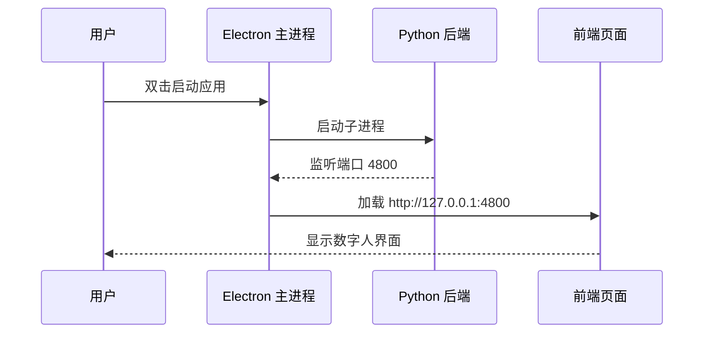

## 产品概述

将现有的 Python FastAPI 后端 + React 前端项目封装为 Electron 桌面应用，提供完整的 Windows 安装包，支持强制开机自启和自动覆盖升级。

## 核心功能

- Electron 桌面应用封装，统一管理前后端进程
- 标准安装向导，支持用户自定义安装路径
- 强制开机自启（通过注册表 HKLM 实现，用户不可关闭）
- 安装新版本时自动卸载旧版本
- 数据持久化（数据库、日志存放在用户数据目录，不受升级影响）
- 系统托盘图标，支持最小化到托盘

## 技术栈选型

- **桌面框架**：Electron 33.x + TypeScript
- **后端打包**：PyInstaller 6.x（打包 Python FastAPI 为单文件 exe）
- **安装包**：electron-builder 25.x + NSIS 3.x
- **进程管理**：Node.js child_process（管理 Python 子进程）

## 实现方案

### 1. 整体架构

```
Electron 主进程
    ├── 启动 Python 后端子进程（backend.exe）
    ├── 加载前端静态资源（frontend/dist）
    ├── 管理窗口生命周期
    └── 系统托盘图标
```

### 2. 进程启动流程



### 3. 目录结构设计

```
d:/DeLu/question/
├── electron/                      # [NEW] Electron 项目目录
│   ├── main.ts                    # 主进程入口
│   ├── preload.ts                 # 预加载脚本
│   ├── python-launcher.ts         # Python 进程管理
│   ├── tray-manager.ts            # 托盘管理
│   ├── package.json               # Electron 依赖
│   └── electron-builder.yml       # 打包配置
├── build/                         # [NEW] 打包资源
│   ├── icon.ico                   # 应用图标
│   ├── installer.nsh              # NSIS 自定义脚本
│   └── env-config.json            # 环境变量配置模板
├── scripts/                       # [NEW] 打包脚本
│   ├── build-python.ps1           # 打包 Python 后端
│   └── build-all.ps1              # 一键打包脚本
└── [existing files...]
```

### 4. 关键技术决策

| 问题 | 方案 | 理由 |
| --- | --- | --- |
| Python 后端打包 | PyInstaller 单文件模式 | 简化部署，避免依赖问题 |
| 数据存储位置 | `%APPDATA%/science-museum-digital-human/data/` | 用户数据独立于程序，升级不丢失 |
| 开机自启 | NSIS 写入 HKLM 注册表 | 系统级自启，普通用户无法关闭 |
| 旧版本卸载 | NSIS 安装前执行卸载命令 | 通过 GUID 识别旧版本并静默卸载 |
| 前端加载 | 加载 http://127.0.0.1:4800 | 复用现有 FastAPI 静态文件服务 |


### 5. NSIS 安装包特性

- 标准安装向导界面
- 用户可选安装路径
- 安装前自动检测并卸载旧版本
- 写入注册表实现强制开机自启
- 创建桌面快捷方式和开始菜单项
- 卸载时清理注册表和快捷方式（保留用户数据）

### 6. 数据持久化策略

```
程序安装目录（会被覆盖）
├── science-museum-digital-human.exe  (Electron 主程序)
├── resources/
│   ├── backend.exe                   (Python 后端)
│   └── app.asar                      (前端资源备份)

用户数据目录（不受升级影响）
%APPDATA%/science-museum-digital-human/
├── data/
│   └── museum.db                     (数据库)
├── logs/
│   └── runtime.log                   (运行日志)
└── config/
    └── upstream.json                 (上游配置)
```

### 7. 性能与可靠性

- Python 后端启动时间约 3-5 秒，前端等待后端就绪再加载
- 使用 `electron-squirrel-startup` 处理 Windows 安装/卸载事件
- 进程守护：Python 崩溃时自动重启
- 端口冲突检测：启动前检测 4800 端口是否可用

## 目录结构详情

```
d:/DeLu/question/
├── electron/                              # [NEW] Electron 桌面应用
│   ├── main.ts                            # 主进程：启动 Python 后端、创建窗口、管理托盘
│   ├── preload.ts                         # 预加载脚本：暴露安全 API 给渲染进程
│   ├── python-launcher.ts                 # Python 进程管理：启动、监控、重启
│   ├── tray-manager.ts                    # 系统托盘：图标、菜单、通知
│   ├── window-manager.ts                  # 窗口管理：创建、最小化、关闭
│   ├── package.json                       # Electron 项目配置和依赖
│   ├── tsconfig.json                      # TypeScript 配置
│   └── electron-builder.yml               # electron-builder 打包配置
├── build/                                 # [NEW] 打包资源
│   ├── icon.ico                           # 应用图标（256x256）
│   ├── installer.nsh                      # NSIS 自定义脚本（开机自启、卸载旧版）
│   ├── license.txt                        # 安装协议
│   └── env-config.json                    # 环境变量配置模板
├── scripts/                               # [NEW] 打包脚本
│   ├── build-python.ps1                   # 使用 PyInstaller 打包 Python 后端
│   ├── build-frontend.ps1                 # 使用 Vite 打包前端
│   └── build-all.ps1                      # 一键完整打包流程
├── backend/                               # [MODIFY] 添加 PyInstaller 配置
│   ├── backend.spec                       # [NEW] PyInstaller 打包配置
│   └── [existing files...]
├── frontend/                              # [EXISTING] 无需修改
└── [existing files...]
```

## 关键代码结构

```typescript
// electron/main.ts - 核心启动逻辑
interface AppConfig {
  pythonExePath: string;      // Python 后端 exe 路径
  backendPort: number;        // 后端端口，默认 4800
  userDataPath: string;       // 用户数据目录 %APPDATA%/...
  dataDir: string;            // 数据库目录
}

// electron/python-launcher.ts - Python 进程管理
interface PythonLauncher {
  start(): Promise<void>;           // 启动 Python 子进程
  stop(): Promise<void>;            // 停止进程
  isReady(): Promise<boolean>;      // 检测后端是否就绪
  onCrash(callback: () => void);    // 崩溃回调
}
```

```python
# backend/backend.spec - PyInstaller 配置
a = Analysis(
    ['app/main.py'],
    pathex=[],
    binaries=[],
    datas=[('app', 'app')],  # 包含 app 模块
    hiddenimports=['uvicorn.logging', 'websockets'],
    name='backend',
    console=False,  # 隐藏控制台窗口
)
```

```
# electron/electron-builder.yml - 打包配置
win:
  target: nsis
  icon: build/icon.ico

nsis:
  oneClick: false
  perMachine: true
  allowToChangeInstallationDirectory: true
  include: build/installer.nsh
  createDesktopShortcut: always
  createStartMenuShortcut: true

# 其他配置...
```

## Agent Extensions

### SubAgent

- **code-explorer**
- Purpose: 探索现有项目的依赖关系和配置细节，确保打包配置的准确性
- Expected outcome: 确认所有 Python 依赖、前端资源路径、环境变量需求